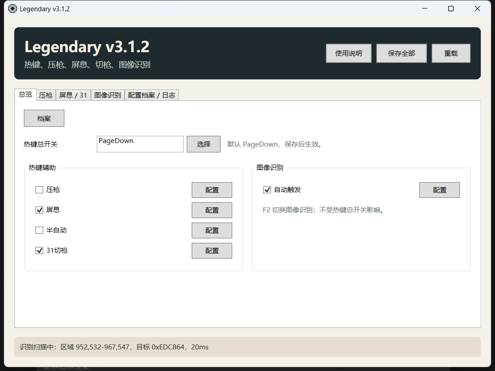
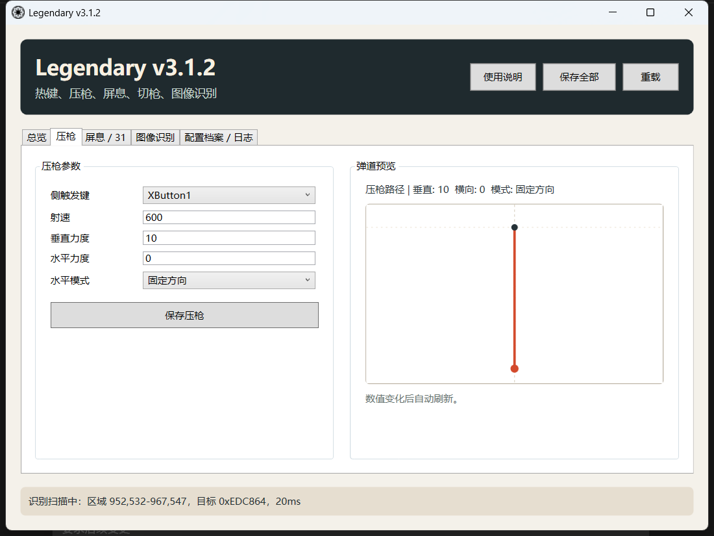
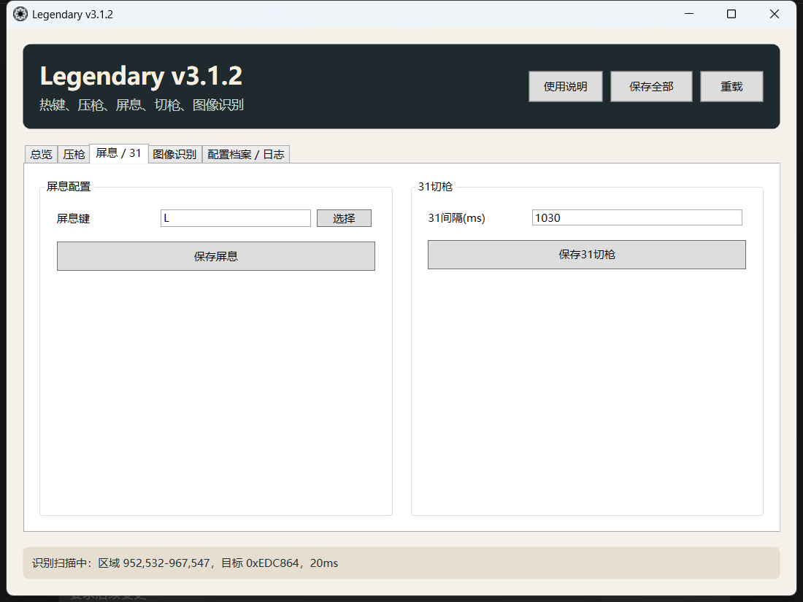
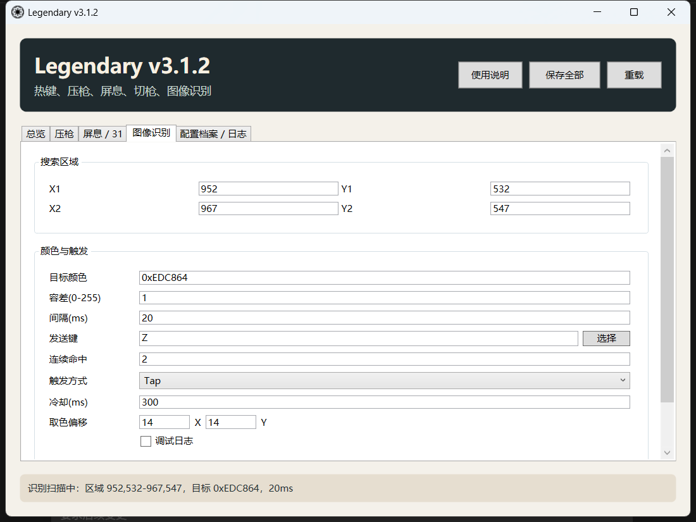
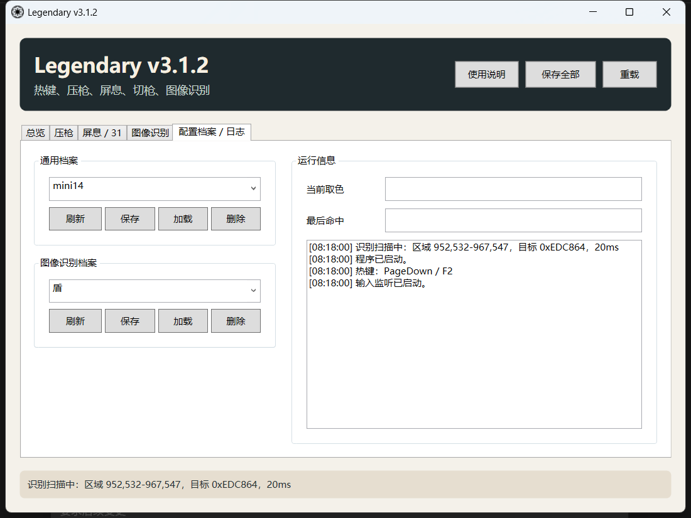

# Legendary v3.1.2 使用教程

本文档是项目的主使用教程。README 继续保留版本更新记录，这里集中说明每个功能怎么配置、怎么保存、怎么排查。

请只在本地、授权或训练测试环境中使用本项目。不同程序、系统权限和显示模式会影响热键、截图和输入发送结果，遇到异常时优先看本文档末尾的排查章节。

## 目录

- [首次启动](#首次启动)
- [语言切换](#语言切换)
- [总览与全局开关](#总览与全局开关)
- [压枪](#压枪)
- [半自动](#半自动)
- [屏息](#屏息)
- [31切枪](#31切枪)
- [图像识别](#图像识别)
- [配置档案与日志](#配置档案与日志)
- [重新生成 exe](#重新生成-exe)
- [常见问题](#常见问题)

## 首次启动

1. 找到发行版 exe：

```text
bin\Release\net10.0-windows\win-x64\publish\LegendaryCSharp.exe
```

2. 右键 exe，选择“以管理员身份运行”。
3. 启动后先看窗口底部状态栏。正常情况下会显示配置加载、识别扫描状态或等待状态。
4. 改完参数后点“保存全部”，或者在对应页面点单独保存按钮。

## 语言切换

主窗口右上角有语言选择框，可在 `中文` 和 `English` 之间切换。

- 切换后，主界面按钮、标签、状态栏、日志提示、按键选择窗口、取色/框选窗口、调试浮窗和内置使用说明会跟随刷新。
- 语言选择会保存到主配置 `LegendaryCSharp.settings.json`，下次启动继续使用。
- 后续如果新增按钮、配置项、状态提示或错误提示，需要同步补充 `Localization.cs` 和 `UsageGuide.cs`。

程序会在 exe 同目录保存当前配置：

```text
LegendaryCSharp.settings.json
LegendaryCSharp.image-recognition.json
```

档案会保存到 Windows 用户数据目录：

```text
%AppData%\Legendary\Profiles
```

## 总览与全局开关



总览页用于快速开关主要功能和跳转配置。

### 热键总开关

- 默认热键：`PageDown`
- 作用范围：压枪、屏息、半自动、31切枪这些热键辅助
- 不影响图像识别；图像识别只看“自动触发”和 `F2`

如果要改总开关热键：

1. 在“热键总开关”处点“选择”。
2. 选择支持的按键。
3. 点“保存全部”。

### 热键辅助区域

- “压枪”：控制压枪移动功能。
- “屏息”：控制侧触发键按下时是否自动按住屏息键。
- “半自动”：控制按射速节奏工作的半自动模式。
- “31切枪”：控制滚轮下触发的切枪流程。

每个功能右侧都有“配置”按钮，点击会跳到对应配置页。

### 图像识别区域

- “自动触发”：图像识别主开关。
- `F2`：图像识别独立热键开关。
- 热键总开关关闭时，图像识别仍可继续运行。

## 压枪



压枪放在最前面，因为它是热键辅助里最核心的功能。

### 触发方式

压枪启动条件：

```text
热键总开关开启
+ 总览里勾选“压枪”
+ 按住侧触发键
+ 按住左键
```

松开侧触发键或左键后，压枪停止。

### 参数说明

| 参数 | 说明 |
| --- | --- |
| 侧触发键 | 启动压枪的辅助键，可选 `XButton2`、`XButton1`、`RButton`、`MButton` |
| 射速 | 用来控制每次补偿的节奏，数值越高，补偿循环越密 |
| 垂直力度 | 鼠标向下移动的主要补偿量 |
| 水平力度 | 鼠标左右方向补偿量 |
| 水平模式 | “固定方向”持续向一个方向补偿；“左右交替”按次数左右交替 |

### 弹道预览

右侧“弹道预览”显示的是当前参数对应的压枪移动路径。

- 固定方向：按当前水平和垂直力度累计显示路径。
- 左右交替：水平路径会左右交替显示。
- 预览只用于理解参数方向，不代表所有程序里的真实画面变化。

### 保存方式

改完压枪参数后，可以点：

- “保存压枪”：只保存热键辅助相关配置。
- “保存全部”：保存所有当前配置。

## 半自动

半自动和压枪使用同一组“侧触发键”和“射速”参数。

启动条件：

```text
热键总开关开启
+ 总览里勾选“半自动”
+ 按住侧触发键
+ 按住左键
```

半自动会根据“射速”参数执行节奏控制。  
如果你只想检查半自动是否工作，可以先确认：

- 总览里“半自动”已勾选。
- 侧触发键设置正确。
- `PageDown` 热键总开关处于开启状态。
- 改完参数后已经保存。

## 屏息



屏息用于在按住侧触发键时同步按住指定屏息键。

启动条件：

```text
热键总开关开启
+ 总览里勾选“屏息”
+ 按住侧触发键
```

### 参数说明

| 参数 | 说明 |
| --- | --- |
| 屏息键 | 要自动按住的键，默认 `L` |

松开侧触发键时，程序会释放屏息键。

## 31切枪

31切枪在“屏息 / 31”页配置。

启动条件：

```text
热键总开关开启
+ 总览里勾选“31切枪”
+ 滚轮下
```

### 参数说明

| 参数 | 说明 |
| --- | --- |
| 31间隔(ms) | 触发后按 `3` 和按 `1` 之间的间隔 |

程序内部有触发间隔保护，避免滚轮连续滚动时重复触发过快。

## 图像识别



图像识别用于在指定屏幕区域内查找目标颜色。它和热键辅助总开关分开。

启动条件：

```text
总览里勾选“自动触发”
+ F2 图像识别开关开启
+ 目标颜色格式正确
+ 搜索区域有效
```

### 搜索区域

搜索区域由 `X1`、`Y1`、`X2`、`Y2` 决定。

- 区域越小，扫描压力越低。
- 区域越大，截图和逐像素搜索耗时越高。
- 可以点“框选区域”直接用鼠标选择范围。

### 目标颜色

目标颜色格式示例：

```text
0xEDC864
EDC864
```

当前版本已经删除“使用目标颜色”勾选项。只要启用图像识别，就固定使用“目标颜色”框里的颜色。

### 取色

1. 点“取色”。
2. 在放大窗口里移动鼠标。
3. 红框中心就是当前取色像素。
4. 点击后，颜色会出现在旁边的小框里。
5. 如果要用这个颜色，需要手动复制到“目标颜色”输入框。

这样设计是为了避免误点后直接覆盖目标颜色。

### 容差

容差范围是：

```text
0 - 255
```

- `0` 最严格，只匹配完全一致的颜色。
- 数值越大，允许的 RGB 差异越大。
- 如果扫描中但没有命中，可以适当提高容差。

### 间隔

间隔单位是毫秒，当前输入范围会被限制在：

```text
20 - 2000
```

间隔表示“扫描循环的目标周期”，不等于最终反应延迟。最终延迟还会受到截图耗时、搜索区域大小、连续命中、触发冷却、系统调度和目标程序响应方式影响。

### 连续命中

连续命中表示需要连续命中多少次才触发。

- `1`：最直接，适合先测试是否能触发。
- `2` 或 `3`：更稳，但反应会更慢。

### 触发方式

| 模式 | 说明 |
| --- | --- |
| Tap | 点击一次发送键 |
| Down | 按下发送键 |
| Up | 抬起发送键 |
| Auto | 根据当前按键状态自动处理 |

### 冷却(ms)

冷却用于限制两次触发之间的最小间隔。

- 如果需要测试响应速度，先设为 `0`。
- 如果容易重复触发，再增加冷却。

### 调试日志

勾选“调试日志”后，程序会显示扫描、命中和触发状态。  
调试日志适合排查问题，不建议长时间开启。

### 诊断

点“诊断”后，程序会保存实际读取到的搜索区域截图：

```text
image-diagnostic.png
```

如果诊断图不是你预期的区域，说明区域坐标或截图读取方式需要检查。

## 配置档案与日志



配置档案分两类：

| 档案类型 | 保存内容 |
| --- | --- |
| 通用档案 | 压枪、屏息、半自动、31切枪等热键辅助参数 |
| 图像识别档案 | 搜索区域、目标颜色、容差、发送键、触发方式等 |

### 保存档案

1. 在档案输入框里输入名称。
2. 点“保存”。
3. 按钮会短暂显示“已保存”，然后恢复。

### 加载档案

1. 在下拉框里选择档案。
2. 点“加载”。
3. 按钮会短暂显示“已加载”，然后恢复。

### 删除档案

1. 选择档案。
2. 点“删除”。
3. 删除后点“刷新”可以重新读取列表。

### 运行信息

运行信息区域会显示：

- 当前取色
- 最后命中
- 日志

日志会自动限制最大行数，避免运行太久拖慢界面。

## 重新生成 exe

如果你修改了源码，需要重新生成发行版 exe。

### PowerShell

```powershell
cd C:\Users\Legen\Desktop\LegendaryCSharp
.\.dotnet-cli\dotnet.exe build
.\.dotnet-cli\dotnet.exe publish -c Release -r win-x64 --self-contained true -p:PublishSingleFile=true
```

生成位置：

```text
C:\Users\Legen\Desktop\LegendaryCSharp\bin\Release\net10.0-windows\win-x64\publish\LegendaryCSharp.exe
```

如果你的系统 PATH 里有 dotnet，也可以直接用：

```powershell
dotnet build
dotnet publish -c Release -r win-x64 --self-contained true -p:PublishSingleFile=true
```

## 常见问题

### 热键没反应

优先检查：

- 是否以管理员身份运行。
- `PageDown` 热键总开关是否开启。
- 总览里对应功能是否勾选。
- 改完参数后是否保存。
- 侧触发键是否和你实际按的键一致。

### 图像识别没启动

优先检查：

- 总览里“自动触发”是否勾选。
- `F2` 图像识别开关是否开启。
- 状态栏是否显示“识别扫描中”。
- 目标颜色格式是否正确。

### 图像识别扫描中但不触发

优先检查：

- 搜索区域是否框对。
- 目标颜色是否真实来自当前画面。
- 容差是否过低。
- 连续命中是否过高。
- 冷却是否过大。
- 是否打开了“诊断”查看实际截图。

### 图像识别反应比间隔慢

间隔不是最终反应时间。最终耗时还包括：

- 截图耗时
- 搜色耗时
- 连续命中次数
- 触发冷却
- 输入发送和目标程序响应
- Windows 调度误差

如果只是排查性能，建议临时使用：

```text
间隔：20
连续命中：1
冷却：0
调试日志：关
搜索区域：尽量小
```

### 加载档案后按钮变成“已加载”且不能点

v3.1.2 后续修复版已处理这个问题。按钮反馈只会短暂变色，不会永久禁用。

### GitHub 上为什么没有 exe

仓库 `.gitignore` 会忽略：

```text
bin/
obj/
.dotnet-cli/
*.exe
```

这是正常的。GitHub 仓库放源码，exe 建议放到 GitHub Releases。

---

# Legendary v3.1.2 Usage Guide

This is the main usage guide for the project. The README keeps the release history, while this document focuses on configuration, saving, and troubleshooting.

Use this project only in local, authorized, or training environments. Different programs, system permissions, and display modes can affect hotkeys, screenshots, and input sending. If anything behaves unexpectedly, start with the troubleshooting section at the end.

## Contents

- [First Launch](#first-launch)
- [Language Switching](#language-switching)
- [Overview And Global Switches](#overview-and-global-switches)
- [Recoil](#recoil)
- [Semi-Auto](#semi-auto)
- [Breath Hold](#breath-hold)
- [31 Swap](#31-swap)
- [Image Recognition](#image-recognition)
- [Profiles And Logs](#profiles-and-logs)
- [Rebuild The Exe](#rebuild-the-exe)
- [FAQ](#faq)

## First Launch

1. Find the release executable:

```text
bin\Release\net10.0-windows\win-x64\publish\LegendaryCSharp.exe
```

2. Right-click the exe and choose **Run as administrator**.
3. After launch, check the status bar at the bottom. It normally shows settings loaded, recognition scan status, or waiting status.
4. After changing parameters, click `保存全部 / Save All`, or click the save button on the corresponding page.

## Language Switching

The top-right corner of the main window has a language selector. You can switch between `中文` and `English`.

- After switching, main labels, buttons, status bar, log messages, key picker, color picker, region selector, debug overlays, and the built-in guide follow the selected language.
- The language selection is saved to `LegendaryCSharp.settings.json` and reused next time.
- When adding new buttons, settings, status messages, or error messages later, update `Localization.cs` and `UsageGuide.cs` together.

The program saves current configuration beside the exe:

```text
LegendaryCSharp.settings.json
LegendaryCSharp.image-recognition.json
```

Profiles are saved under the Windows user data folder:

```text
%AppData%\Legendary\Profiles
```

## Overview And Global Switches


The overview page is used to quickly toggle major features and jump to configuration pages.

### Hotkey Master

- Default hotkey: `PageDown`
- Scope: recoil, breath hold, semi-auto, and 31 swap.
- It does not affect image recognition. Image recognition only depends on `Auto Trigger` and `F2`.

To change the master hotkey:

1. Click `选择 / Select` beside `热键总开关 / Hotkey Master`.
2. Choose a supported key.
3. Click `保存全部 / Save All`.

### Hotkey Assist Area

- `压枪 / Recoil`: controls recoil movement.
- `屏息 / Breath Hold`: automatically holds the breath key while the side trigger is held.
- `半自动 / Semi-Auto`: runs the semi-auto rhythm according to fire rate.
- `31切枪 / 31 Swap`: controls the wheel-down swap flow.

Each feature has a `配置 / Config` button on the right. Click it to jump to the corresponding settings page.

### Image Recognition Area

- `自动触发 / Auto Trigger`: main switch for image recognition.
- `F2`: independent image recognition hotkey switch.
- Image recognition can keep running even when the hotkey master is off.

## Recoil


Recoil is listed first because it is the core hotkey-assisted feature.

### Trigger Conditions

Recoil starts when all of the following are true:

```text
Hotkey Master is on
+ Recoil is checked in Overview
+ Side trigger is held
+ Left click is held
```

Recoil stops when the side trigger or left click is released.

### Parameters

| Parameter | Description |
| --- | --- |
| Side Trigger | The helper key used to start recoil. Options include `XButton2`, `XButton1`, `RButton`, and `MButton`. |
| Fire Rate | Controls the rhythm of each compensation step. Higher values mean denser compensation loops. |
| Vertical Force | Main downward mouse movement compensation. |
| Horizontal Force | Left-right mouse movement compensation. |
| Horizontal Mode | `Fixed Direction` keeps moving in one direction. `Alternating` alternates left and right by step count. |

### Trajectory Preview

The right-side trajectory preview shows the recoil movement path generated by the current parameters.

- Fixed Direction: accumulates the current horizontal and vertical values.
- Alternating: displays a left-right alternating horizontal path.
- The preview is only for understanding parameter direction. It does not represent the real image behavior of every target program.

### Saving

After changing recoil parameters, you can click:

- `保存压枪 / Save Recoil`: saves only hotkey-assisted settings.
- `保存全部 / Save All`: saves all current settings.

## Semi-Auto

Semi-auto uses the same `Side Trigger` and `Fire Rate` parameters as recoil.

Trigger conditions:

```text
Hotkey Master is on
+ Semi-Auto is checked in Overview
+ Side trigger is held
+ Left click is held
```

Semi-auto follows the rhythm defined by `Fire Rate`.

If you only want to check whether semi-auto is working, confirm:

- `半自动 / Semi-Auto` is checked in Overview.
- Side trigger is configured correctly.
- `PageDown` hotkey master is on.
- Parameters have been saved after changes.

## Breath Hold


Breath hold presses and holds the configured breath key while the side trigger is held.

Trigger conditions:

```text
Hotkey Master is on
+ Breath Hold is checked in Overview
+ Side trigger is held
```

### Parameters

| Parameter | Description |
| --- | --- |
| Breath Key | The key to hold automatically. Default is `L`. |

When the side trigger is released, the program releases the breath key.

## 31 Swap

31 swap is configured on the `屏息 / 31` page.

Trigger conditions:

```text
Hotkey Master is on
+ 31 Swap is checked in Overview
+ Mouse wheel down
```

### Parameters

| Parameter | Description |
| --- | --- |
| 31 Interval (ms) | Delay between pressing `3` and pressing `1` after the trigger. |

There is an internal trigger interval guard to avoid repeated triggers caused by rapid wheel scrolling.

## Image Recognition


Image recognition searches for the target color inside the specified screen region. It is separate from the hotkey master.

Trigger conditions:

```text
Auto Trigger is checked in Overview
+ F2 image recognition switch is on
+ Target color format is valid
+ Search region is valid
```

### Search Region

The search region is defined by `X1`, `Y1`, `X2`, and `Y2`.

- Smaller regions reduce scanning pressure.
- Larger regions increase screenshot and pixel-search time.
- You can click `框选区域 / Select Region` to select the range directly with the mouse.

### Target Color

Target color format examples:

```text
0xEDC864
EDC864
```

The current version has removed the `Use Target Color` checkbox. When image recognition is enabled, it always uses the value in `Target Color`.

### Pick Color

1. Click `取色 / Pick Color`.
2. Move the mouse inside the magnifier window.
3. The center of the red box is the current picked pixel.
4. After clicking, the color appears in the small extracted-color field.
5. To use that color, copy it manually into the `Target Color` input.

This prevents accidental color picking from overwriting the active target color directly.

### Tolerance

Tolerance range:

```text
0 - 255
```

- `0` is the strictest and only matches the exact color.
- Higher values allow larger RGB differences.
- If recognition is scanning but not matching, raise tolerance gradually.

### Interval

Interval is measured in milliseconds. The current input range is clamped to:

```text
20 - 2000
```

Interval means the target period of the scan loop. It is not the final reaction latency. Final latency also includes screenshot time, search region size, hit-streak requirement, trigger cooldown, system scheduling, and the target program's response behavior.

### Hit Streak

Hit Streak means how many consecutive matches are required before triggering.

- `1`: most direct, useful for testing whether triggering works.
- `2` or `3`: more stable, but slower.

### Trigger Mode

| Mode | Description |
| --- | --- |
| Tap | Clicks the send key once. |
| Down | Presses the send key down. |
| Up | Releases the send key. |
| Auto | Handles the key according to current key state. |

### Cooldown (ms)

Cooldown limits the minimum interval between two triggers.

- For response testing, set it to `0` first.
- If repeated triggers happen too easily, increase cooldown.

### Debug Log

When `调试日志 / Debug Log` is checked, the program shows scanning, match, and trigger status.

Debug logging is useful for troubleshooting, but it is not recommended for long continuous sessions.

### Diagnose

Click `诊断 / Diagnose` to save the actual captured search-region screenshot:

```text
image-diagnostic.png
```

If the diagnostic image is not the expected region, check region coordinates or the screenshot capture method.

## Profiles And Logs


Profiles are separated into two types:

| Profile Type | Saved Content |
| --- | --- |
| General Profile | Recoil, breath hold, semi-auto, 31 swap, and other hotkey-assisted parameters. |
| Image Recognition Profile | Search region, target color, tolerance, send key, trigger mode, and related image-recognition settings. |

### Save Profile

1. Enter a name in the profile input box.
2. Click `保存 / Save`.
3. The button briefly displays `已保存 / Saved`, then returns to normal.

### Load Profile

1. Select a profile in the dropdown.
2. Click `加载 / Load`.
3. The button briefly displays `已加载 / Loaded`, then returns to normal.

### Delete Profile

1. Select a profile.
2. Click `删除 / Delete`.
3. After deleting, click `刷新 / Refresh` to reload the list.

### Runtime Info

The runtime info area shows:

- Picked color
- Last match
- Log

The log automatically limits the maximum retained line count so the UI will not slow down after long sessions.

## Rebuild The Exe

If you modify source code, rebuild the release executable.

### PowerShell

```powershell
cd C:\Users\Legen\Desktop\LegendaryCSharp
.\.dotnet-cli\dotnet.exe build
.\.dotnet-cli\dotnet.exe publish -c Release -r win-x64 --self-contained true -p:PublishSingleFile=true
```

Output path:

```text
C:\Users\Legen\Desktop\LegendaryCSharp\bin\Release\net10.0-windows\win-x64\publish\LegendaryCSharp.exe
```

If `dotnet` is available in your system PATH, you can also use:

```powershell
dotnet build
dotnet publish -c Release -r win-x64 --self-contained true -p:PublishSingleFile=true
```

## FAQ

### Hotkeys Do Not Respond

Check first:

- Whether the program is running as administrator.
- Whether the `PageDown` hotkey master is on.
- Whether the corresponding feature is checked in Overview.
- Whether parameters were saved after changes.
- Whether the side trigger matches the key you are actually pressing.

### Image Recognition Does Not Start

Check first:

- Whether `自动触发 / Auto Trigger` is checked in Overview.
- Whether the `F2` image recognition switch is on.
- Whether the status bar shows recognition scanning.
- Whether the target color format is valid.

### Image Recognition Scans But Does Not Trigger

Check first:

- Whether the search region is correct.
- Whether the target color is truly picked from the current screen.
- Whether tolerance is too low.
- Whether hit streak is too high.
- Whether cooldown is too large.
- Whether you have used `诊断 / Diagnose` to inspect the actual screenshot.

### Image Recognition Is Slower Than The Interval

Interval is not final reaction time. Final time also includes:

- Screenshot time
- Color-search time
- Hit-streak count
- Trigger cooldown
- Input sending and target-program response
- Windows scheduling variance

For performance testing, temporarily use:

```text
Interval: 20
Hit Streak: 1
Cooldown: 0
Debug Log: Off
Search Region: As small as practical
```

### After Loading A Profile, The Button Gets Stuck As Loaded

This has been fixed in the v3.1.2 follow-up patch. Button feedback only changes color briefly and does not permanently disable the button.

### Why There Is No Exe On GitHub

The repository `.gitignore` ignores:

```text
bin/
obj/
.dotnet-cli/
*.exe
```

This is normal. The GitHub repository should store source code. The exe is better uploaded to GitHub Releases.
